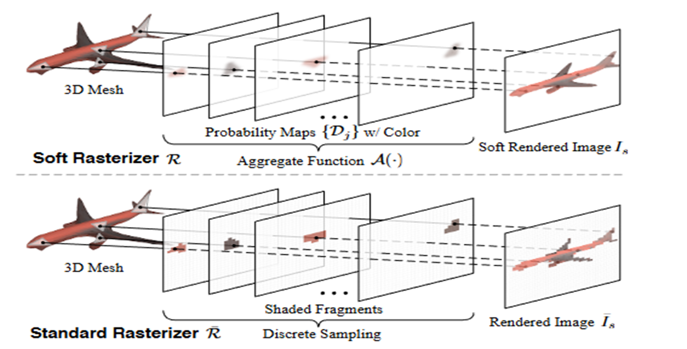
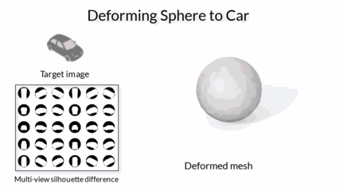
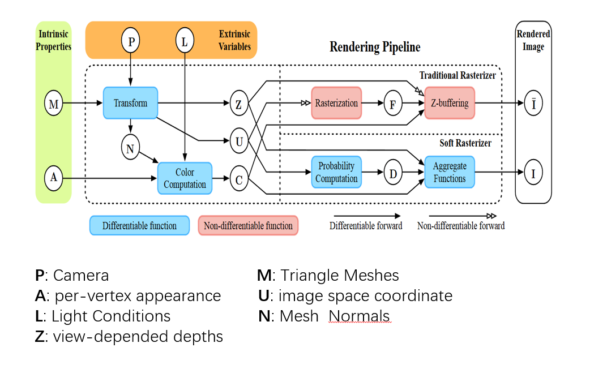
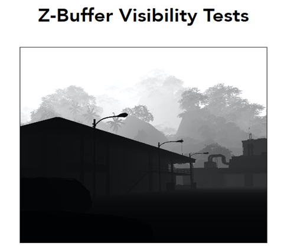
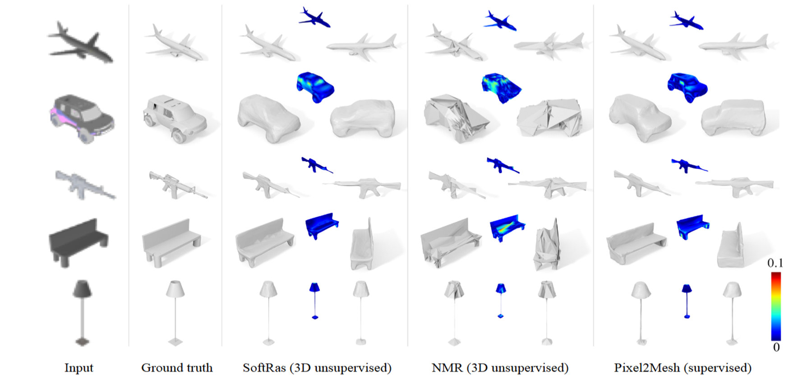
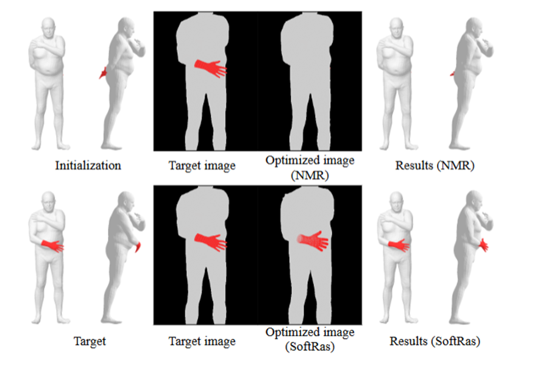
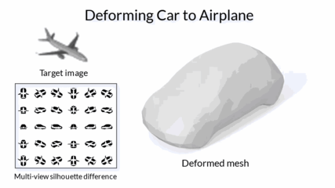

<!-- #! https://zhuanlan.zhihu.com/p/890520886 -->
<!-- ---
bibliography: [./reference.bib]
--- -->

<!-- # Differential rendering and 3d Gaussian -->
# 可微渲染和3D高斯

本文记述了笔者对于可微渲染以及后来的3d 高斯演化之间的一点关联和思考
## 研究动机

上图可以看作一个传统的渲染流程的一个简要说明，给定如材质，光照，相机参数以及mesh几何这些基本要素，可以通过对物理成像过程的模拟即所谓的传统渲染管线进行渲染，最终得到我们在屏幕上所看到的二维的图片

这是传统渲染的流程，类似于一个由因到果的过程，给定初始条件以及相应的演化方程，最终得到在演化方程约束下的结果，但对于ai训练来说，其过程经常是相反的，ai一般通过大量的数据进行端到端学习，通过数据由结果推得最开始的条件，但对于端到端训练的ai模型来说，由于其涉及到大量的参数需要优化，其优化过程是高度不稳定的，往往需要很强的约束进行引导

在数学层面，梯度表示输入参数的微小变动对于最终输出结果的影响，是一个很强的约束效果，对于渲染管线来说，如果我们可以获得最终渲染的图像相对于最初输入条件如mesh几何顶点位置，材质这些参数的梯度，那就可以通过最终渲染图像的结果来引导输入参数如3d 模型进行形变，下面的动画就是一个典型的例子，它通过图片以及相应的梯度来引导3d mesh发生形变使得mesh从原来的球体变成了一个小汽车

但比较棘手的是传统管线并不全程可微，导致不能获取最终输出结果相对于输入参数的梯度，而可微渲染正是为了去解决这一问题，首先先让我们来了解一下为什么传统管线并不可微
## 传统管线

上图是传统管线的一个简要说明，对于传统管线来说，它需要一些输入参数，如3d mesh资产M，以及资产本身的物理属性A如粗糙度，反照率等这些资产内在的属性参数，以及如相机参数P，光照条件L这些外部环境参数,在渲染过程中首先需要对3d资产M做一个model变换，这是一个矩阵，作用是通过伸缩以及平移等变换把M添加到计算机世界坐标系中来，之后经过一个view 变换矩阵将这些资产M变换到相机P为坐标原点的坐标系中去方便后续处理，这两个步骤就是上图的Transform，注意这些变换都是做了一些简单的矩阵乘法，是可以用数学公式进行刻画的，所以这些步骤自然是可微的，上图的N是经过变换后在相机坐标系下的法线，在这里我们采用简单的blinn-phone模型进行颜色计算，对于phone模型来说，计算每个mesh顶点的颜色需要用到mesh顶点的法线方向，顶点本身的物理属性以及光照和光源与顶点之间的距离信息，这些都是完全已知的数学量，由此便可以通过数学公式严格计算出每个顶点的颜色

注意之前所描述的所有步骤都是有严格的数学公式的，所以它们自然是可微的，但接下来要进行所谓的光栅化Rasterization,如下图所示,简单来说mesh网格是由一个个三角形片组成的，每个三角形片的顶点都被赋予了一定的属性并经过之前的步骤计算出了对应的颜色，但一个三角形片往往覆盖着多个屏幕上的像素点，这就需要通过重心插值来计算三角形覆盖的像素点的颜色，这是有严格数学定义的，但对于三角形片边缘的像素点在考虑其是否属于三角形内部时一般是对像素点的中心点如图中的红色点是否在三角形内部进行判断的，这就是一个简单的人为判断标准并没有严格的数学公式进行描述，所以这个过程是不可微的

<!--  -->

在光栅化之后进入了最终的成像阶段，对于传统管线来说，其遵循物理上近的物体会遮盖远的物体这一物理事实，如下图所示那样，房屋因为更近一点自然就遮住了后面的树，在计算机上就是所谓的zbuffer，即一个像素点会被多个三角形片覆盖，zbuffer会筛选出最近的一个三角形片作为最终成像的结果，这也是一个离散采样的结果，自然也是不可微的，上述两个步骤是导致传统管线不可微的原因，这也是可微渲染需要改造的部分,接下来我将详细讲述下可微渲染

## 可微渲染管线

首先对于第一个不可微的光栅化过程，可微渲染将其代替为一个概率计算公式，具体计算公式如下：
$$
    D_j^i=sigmoid(\delta_j^i \cdot \frac{d^2(i,j)}{\sigma} )  \\ 
     \delta_j^i=\{+1 \quad if \quad p_i\in f_j;\quad -1 \quad otherwise\}  \\
$$
这里公式的具体说明如下图所示,$f_j$表示任选的一个三角形片元，$p_i$表示选中的屏幕上的一个像素点，$d(i,j)$表示所选中像素点$p_i$和三角形片元的边的最近距离，这里实际上是考虑所有的三角形片元都会对最终的像素点颜色有所贡献，只是按照像素点是否在三角形内部以及相距远近关系对其做了一个具体的数学量化，$\sigma$是一个超参数，用于调整光栅化过程软的程度，当$\sigma$趋近于0时，整个概率计算公式就坍缩到传统渲染的光栅化形式，可以说这是将传统管线的光栅化过程做了一个泛化

而对于后面的zbuffer过程，可微渲染将其改造成了Aggregate Function,其具体数学形式如下所示:
$$
    I^i=\sum_j w_j^iC_j^i +w_b^i C_b \\
$$
这里的i仍然指的是屏幕上的第i个像素点，$C_j^i$指的是第j个三角形片元投影到第i个像素点时所对应的颜色，这个颜色是根据像素点相对于片元的位置通过重心插值线性组合三角形片元顶点颜色计算得到，$C_b$表示为背景颜色，相应的权重计算参考了softmax公式:
$$
    w_j^i=\frac{D_j^i exp(z^i_j/\gamma)}{\sum_k D_k^i exp(z^i_k/\gamma)+exp(\epsilon/\gamma)} \\
$$
这样可以确保最终的权重之和相加为1，上述公式的z表示深度的导数，这样使得距离成像点越近的三角形片元其对最终像素点颜色贡献越大，比较符合物理规律，$\gamma$是一个超参数,通过上述公式将可以比较相对客观的描述每个三角形片元对最终成像点的贡献，而且是全程可微的，接下来我简要展示一下利用这个梯度可以实现的一些有趣任务.
## 有趣的下游相关任务

上图是利用梯度进行ai训练的一个典型任务，它从一张单张图片出发利用梯度作为约束构建出真个三维模型的mesh网格，可以看到相比于其他方法训练效果还是比较不错的 

该任务是利用梯度和一张给定的目标图片去引导人体模型资产变换到给定目标图片所对应的姿态

该任务是通过梯度去引导车子mesh网格形变成飞机mesh网格

上述这些应用都是利用梯度作为约束进行ai的相关训练任务,可以看到梯度约束训练的强大之处，但和这个可微渲染很相关的任务便是如今大火的3d 高斯，3d 高斯也是利用梯度去优化高斯椭球本身的属性去重建最终的3d 模型，但两个任务之间相隔了5年时间，两者如此相像，但为什么从图片生成mesh网格这样的方法并没有在上述可微渲染方法提出来之后迅速火起来呢，为了探究这个问题，我进一步浏览了在3d mesh资产生成相关的代表性工作的发展进度

## 3d mesh生成领域研究

上述两幅图是这个领域最近的相关代表性工作的大致流程图，其首先给定一张输入图片和椭球mesh网格，经过一个形变网络将其变为目标图片的形状，这里的神经网络利用的是图神经网络，网络中的一个节点往往只和它周围的相邻几个节点有关联，这样比较适合一个顶点只受局部场景作用的应用场景，再对形变后的模型进行网格加密操作，经过多次上述的操作，可以得到比较粗略的大致模型，为了进一步细化，文章利用了各种各样的神经网络对其进行优化，一个很大的疑问便是: 

**既然利用梯度进行约束生成对应的3d mesh资产那么强大，为什么这5年来这样的技术没有进一步的发展，反而是利用其他类型的方法进行3d mesh资产的生成呢?**

## 再看高斯:为什么高斯会火起来?

回答高斯为什么会火起来实际上也就是在回答之前对于为什么从图片生成3d mesh资产没有火起来，明明两者的流程和方法论是很相近的，对此我自己的思考如下:

1. mesh本身远比点云复杂，其自身一个三角形片元的顶点发生变化后由于mesh的拓扑连接关系往往会耦合到其他三角形片元，数学约束刻画并不是很直观，优化起来远没有高斯容易
2.  而高斯可以看作之前提到的可微渲染工作的延续，只不过它提出以最新的Gaussian椭球作为3d 模型的基元，高斯模型的核心渲染方程如下所示:

    $$
    C=\sum_{i\in N} c_i \alpha_i \prod_{j=1}^{i-1}(1-\alpha_j) \\
    $$
    $$
    G(x)=exp(-\frac{1}{2}(x)^T\Sigma^{-1}(x)) \\
    $$ 

    上述公式中C表示最终的像素点的颜色，$c_i$表示每个会覆盖对应像素点的高斯椭球的颜色，$\alpha_i$表示其不可见度，某种程度上算是高斯点云的体密度,后面的连乘表示光线在穿过第i个高斯球后其还剩余的能量，这是点云的渲染方程，第二行是高斯椭球概率密度计算公式，其中的$x$表示高斯球中心点的位置,对于高斯点云的渲染方程实际上是对点云渲染方程的拓展，它将不可见度$\alpha_i$额外乘上最终像素点在对应高斯球为中心坐标系下的概率密度分布，而高斯球在最终像素点的颜色贡献利用球谐函数来模拟方向效果，即从不同方向看过去同一个物体的颜色也会有所不同，这就是最终的高斯点云渲染方程

    可以看到高斯点云的渲染方程很自然的将最终像素点的颜色和相关联的高斯点云属性如顶点位置，颜色，不可见度联系起来，同时由于点云之间相互没有关联，其又是全程可微的，同时优化又十分灵活，并且要优化的参数全是输入的高斯点云其自身的属性，这些完全都是显式的有明确物理定义的量，而不是像ai那样利用神经网络对这些量做出假设，自然利用高斯进行三维重建的训练时间就要快的多，同时其本质上更偏向于传统的渲染管线，只不过基元从三角形片元变成了高斯椭球，渲染的时候很轻易就可以达到上百帧没秒，这些优良的特性自然使得高斯变得火热起来

## 融合和统一

虽然利用高斯点云进行三维重建十分方便，但重建后的三维模型仍然是以高斯点云作为基元，但现代的3d资产以及处理方法绝大部分都是针对3d mesh网格的，对高斯点云的支持还很欠缺，一个很自然的想法就是如何从高斯点云中提取出相应的3d mesh网格，在24年2月的最新一篇文章 "SuGar" 便实现了这一想法，简单来说它通过level set从高斯模型中构建出轮廓外观，然后利用 possion reconstructor重建对应的3d mesh资产，整个过程只需几分钟到几十分钟，效果十分惊艳，效果图如下图所示：

上图是将几张图重构的mesh资产添加到一个场景中去重新渲染，得到最右边图的结果，进一步的惊艳效果可以查看对应的链接[sugar](https://github.com/Anttwo/SuGaR),整个可微渲染从开始经过5年慢慢发展出3d 高斯，不得不说真是一趟神奇的旅程

